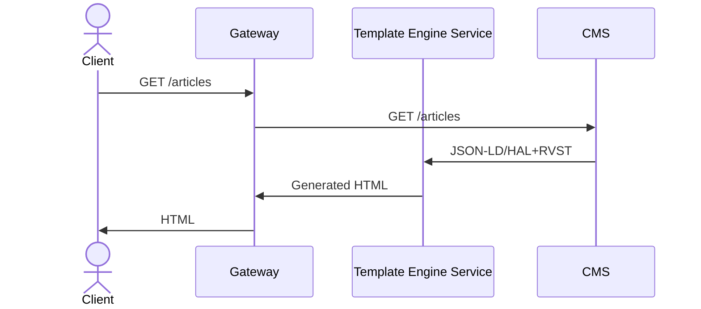
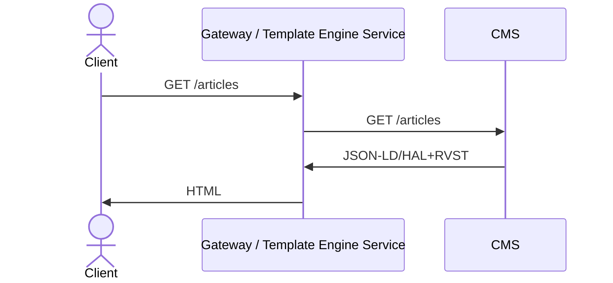
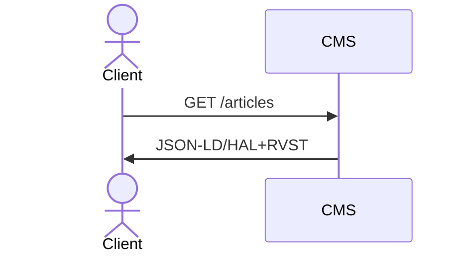
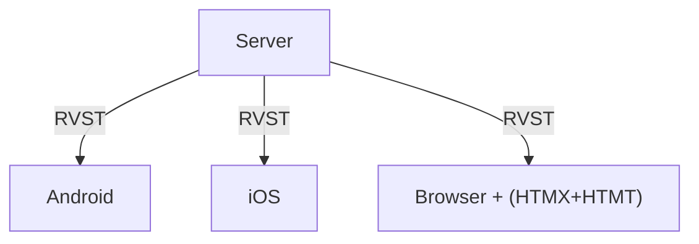

> **Archived RVST content.** This document describes RVST (Representational View State Transfer), the predecessor of the View Descriptor Protocol, and is preserved for reference. For the current standard, see the [VDP specification](../../view-descriptor-protocol.md).

# Patterns

